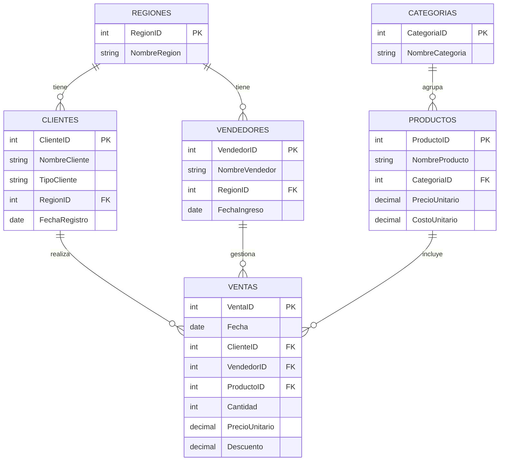

# 📊 Sistema de Inteligencia Comercial — Andina Distribuciones

Proyecto de portafolio en **SQL Server (T-SQL)** que simula el rol de un Analista de Inteligencia Comercial en una distribuidora de consumo masivo con presencia en 6 regiones del Perú.

## 🎯 Contexto de negocio

Andina Distribuciones es una distribuidora ficticia de consumo masivo (abarrotes, bebidas, cuidado personal, limpieza, snacks y lácteos). El equipo comercial tomaba decisiones basadas en reportes manuales, sin visibilidad clara de qué clientes estaban dejando de comprar, qué vendedores rendían mejor, ni qué productos concentraban la rentabilidad.

Este proyecto diseña una base de datos relacional que centraliza clientes, productos, vendedores y transacciones, y desarrolla un set de consultas analíticas para responder preguntas clave de Inteligencia Comercial.

## 🗂️ Modelo de datos



*(GitHub renderiza este diagrama automáticamente al ver el README en el repositorio — no necesitas ninguna imagen adicional.)*

## 🛠️ Stack técnico

- **Motor:** SQL Server (T-SQL) / SSMS
- **Técnicas aplicadas:** modelado relacional, joins múltiples, CTEs, funciones de ventana (`RANK`, `LAG`, `NTILE`), segmentación RFM, vistas, procedimientos almacenados, índices

## 📁 Estructura del repositorio

```
├── Proyecto_SQL_InteligenciaComercial.sql   # Script completo (6 bloques)
├── README.md                                # Este archivo
└── capturas/                                # Screenshots de resultados
    ├── 01_ingreso_margen_region.png
    ├── 02_ranking_vendedores.png
    ├── 03_segmentacion_rfm.png
    └── 04_clientes_en_riesgo.png
```

## 🔍 Principales hallazgos

Sobre ~1,500 transacciones simuladas (2024-2025):

- **Arequipa** lidera en ingresos (S/ 18,744), pero **Lima** tiene el mejor margen bruto (30.0% vs. 28.4%-29.6% en el resto de regiones) — una señal para priorizar mezcla de producto, no solo volumen.
- La segmentación **RFM** identificó clientes "Top" (alta recencia, frecuencia y monto) frente a clientes "en riesgo/inactivo", permitiendo priorizar a qué clientes retener primero.
- El ticket promedio de clientes **mayoristas** (S/ 66.6) es mayor al de **minoristas** (S/ 62.7), consistente con el tipo de negocio.
- El análisis de afinidad de productos identificó más de 150 combinaciones de productos comprados por los mismos clientes — insumo directo para estrategias de cross-selling.

## ▶️ Cómo ejecutarlo

1. Abre `Proyecto_SQL_InteligenciaComercial.sql` en SSMS.
2. Ejecuta los bloques en orden (1 al 6), seleccionando cada bloque y presionando F5.
3. El Bloque 5 contiene las 8 consultas analíticas — ejecútalas una por una para ver cada resultado.

## 👤 Autor

Alonso Ponce — Estudiante de Ingeniería Industrial, Universidad de Lima
[LinkedIn](#) · [Portafolio Power BI](#)

---

*Proyecto complementario a mi [dashboard de Power BI](#) — juntos cubren el flujo completo: SQL (modelado y análisis) → Power BI (visualización).*
